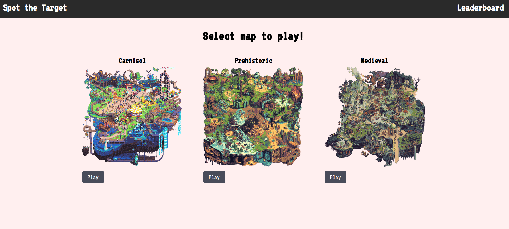
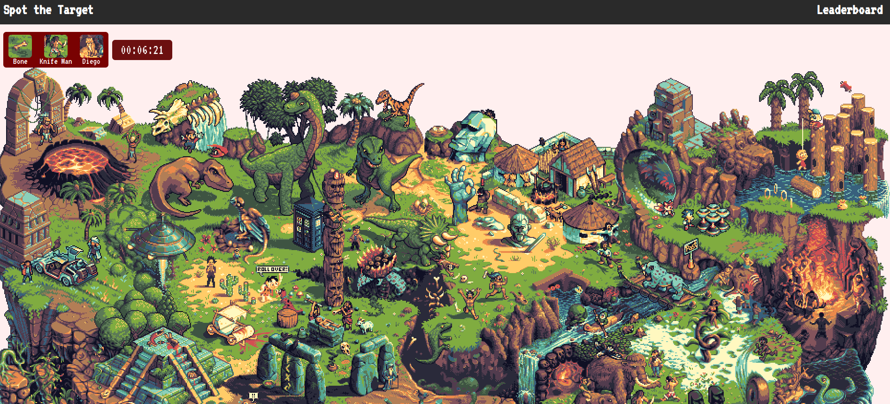
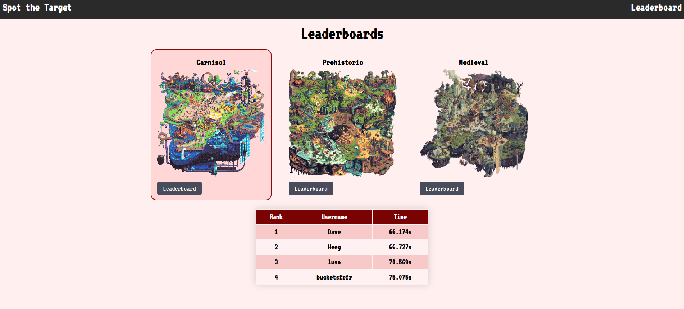

# Spot The Target

This is the frontend of my full stack blog app that uses React and Vite which is hosted on Netlify.

You can check it out here [Live Website](https://spot-the-target.netlify.app/)

Spot The Target API: https://github.com/ImmaCheetah/spot-the-target-backend

## Features
- Notification for user guesses
- Stopwatch to track user playing time
- Three different maps to choose from

## Tools/Languages
  
  
 
 

## Screenshots

## Learning Outcomes
- Normalize coordinates on an image to make clicks register on any screen size
- Handle mouse position to show clicked location correctly
- Manipulate clicked coordinates to show dropdown in correct location
- Proper use of useEffect to handle changing states

Images from:
https://pixeljoint.com/forum/forum_posts.asp?TID=27218
https://pixeljoint.com/forum/forum_posts.asp?TID=26398
https://pixeljoint.com/forum/forum_posts.asp?TID=27120